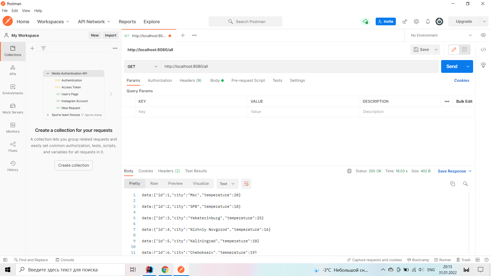
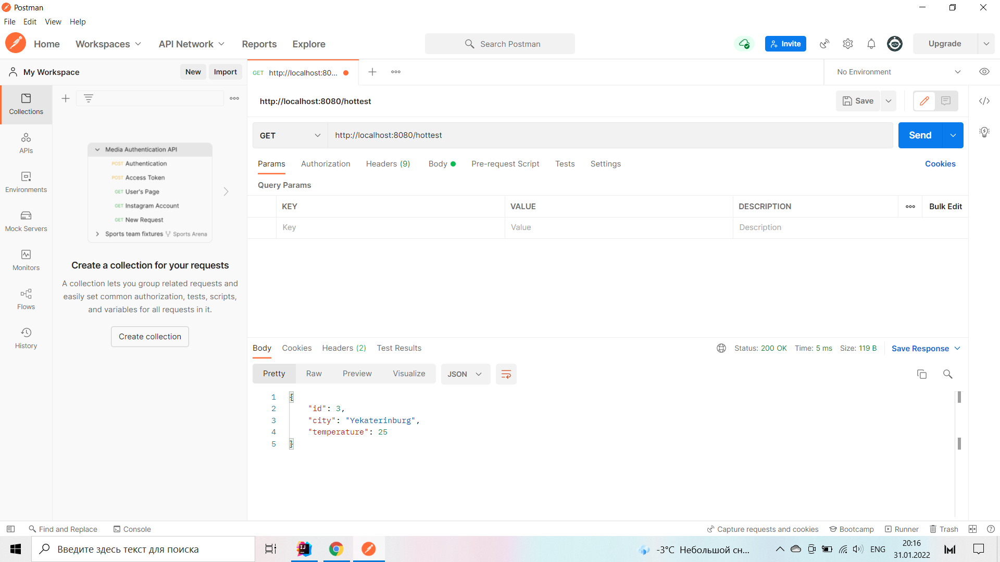

# weather_reactive

Приложение прогноз погоды. Работать оно будет в режиме реактивного программирования.

В приложении будет два запроса.

1. Показать список всех городов с погодой.

2. Показать детальную погоду по выбранному городу.

3. Доработайте контроллер WeatherControl. Добавьте метод, который вернет город с максимальной температурой. /hottest

4. Добавьте метод, который вернет города с температурой выше указанной в запросе /cityGreatThen/30

